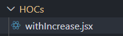

# HOC

> دسته: React Hooks & Performance

**توجه:** الان دیگه `HOC` روش پیشنهادی اصلی نیست. توی داکیومنت رسمی `React` هم اشاره شده که `Hooks` می‌تونن جای خیلی از کاربردهای `HOC` رو بگیرن.

تعریف: `HOC` یک تابع است که یک کامپوننت رو به‌عنوان ورودی می‌گیره و یک کامپوننت جدید رو به‌عنوان خروجی `return` می‌کنه.

نام `HOC` ها با `with` شروع میشود

```jsx
function ReactJs() {
  const [title, setTitle] = useState("react js");

  const [price, setPrice] = useState(2_500_000);

  const increasePrice = () => {
    setPrice((prev) => prev * 2);
  };

  return (
    <div className="w-150 h-20">
            <h2 className="text-2xl text-white">title is: {title}</h2>
      <button className="bg-white rounded-sm p-1 mt-2" onClick={increasePrice}>
        price is: {price}
      </button>
         {" "}
    </div>
  );
}

export default ReactJs;
```

```jsx
function JavaScript() {
  const [title, setTitle] = useState("JavaScript");

  const [price, setPrice] = useState(1_600_000);

  const increasePrice = () => {
    setPrice((prev) => prev * 2);
  };

  return (
    <div className="w-150 h-20">
      <h2 className="text-2xl text-white">title is: {title}</h2>
      <button className="bg-white rounded-sm p-1 mt-2" onClick={increasePrice}>
        price is: {price}
      </button>
    </div>
  );
}

export default JavaScript;
```

این دو کامپوننت دو عمل یکسان انجام میدهند و `state` های یکسانی هم دارند و فقط مقدار آنها متفاوت است در این صورت چند خط دستور درون این دو کامپوننت تکرار شده, در اینجا از `HOC` استفاده میکنیم:



```jsx
function withIncrease(WrappedComponent, courseTitle, coursePrice) {
  const EnhancedComponent = () => {
    const [title, setTitle] = useState(courseTitle);
    const [price, setPrice] = useState(coursePrice);

    const increasePrice = () => {
      setPrice((prev) => prev * 2);
    };

    return (
      <WrappedComponent
        title={title}
        price={price}
        increasePrice={increasePrice}
      />
    );
  };

  return EnhancedComponent;
}

export default withIncrease;
```

نحوه استفاده (در خطی که کامپوننت `export` می‌شود، آن را به‌عنوان ورودی به `HOC` می‌دهیم) :

```jsx {2}
import withIncrease from "../../../HOCs/withIncrease";

function ReactJs({ title, price, increasePrice }) {
  return (
    <div className="w-150 h-20">
            <h2 className="text-2xl text-white">title is: {title}</h2>
      <button className="bg-white rounded-sm p-1 mt-2" onClick={increasePrice}>
        price is: {price}     {" "}
      </button>
         {" "}
    </div>
  );
}

export default withIncrease(ReactJs, "react", 2_600_000); 👈
```

```jsx
import withIncrease from "../../../HOCs/withIncrease";

function JavaScript({ title, price, increasePrice }) {
  return (
    <div className="w-150 h-20">
            <h2 className="text-2xl text-white">title is: {title}</h2>
      <button className="bg-white rounded-sm p-1 mt-2" onClick={increasePrice}>
        price is: {price}
      </button>
    </div>
  );
}

export default withIncrease(JavaScript, "JavaScript", 1_500_000); 👈
```

**نکته:** `HOC` رو نباید داخل رندر یه کامپوننت صدا زد، چون هر بار یه کامپوننت جدید ساخته می‌شه و `state` از دست می‌ره. این یه دام رایجه.

**نکته:** در `HOC` باید یک تابع (کامپوننت) `return` کنیم و هم هوک‌ها و هم `WrappedComponent` رو داخل بدنه‌ی اون تابع قرار بدیم. چون `HOC` خودش یک کامپوننت نیست، بلکه یک تابع `factory` است که موقع `import` اجرا می‌شه؛ پس هوک‌ها نباید مستقیماً داخل بدنه‌ی `HOC` صدا زده بشن.

**نکته:** اگه `WrappedComponent` از قبل پراپ‌هایی دریافت می‌کرد، بعد از `wrap` شدن دیگه مستقیم از والد خودش پراپ نمی‌گیره؛ بلکه این پراپ‌ها اول به `EnhancedComponent` می‌رسن. پس باید با `{...props}` اون‌ها رو به `WrappedComponent` پاس بدیم، وگرنه از دست می‌رن.

```jsx
function withIncrease(WrappedComponent , courseTitle, coursePrice) {
  const EnhancedComponent = (props) => { 👈
    const [title, setTitle] = useState(courseTitle);
    const [price, setPrice] = useState(coursePrice);
    const increasePrice = () => {
      setPrice((prev) => prev * 2);
    };
    return (
      <WrappedComponent
        title={title}
        price={price}
        increasePrice={increasePrice}
        {...props} 👈
      />
    );
  };
  return EnhancedComponent
```

**نکته:** اگه کامپوننت داخلی `HOC` (یعنی `EnhancedComponent`) رو به‌صورت تابع بی‌نام (`anonymous`) تعریف کنیم،

```jsx
return function () {
    const { products, isLoading, error } = useProducts();
    return (
      <section className="container my-12.5">
      ...
```

توی تب `Components` در `React DevTools` با نام `Anonymous` دیده می‌شه.
