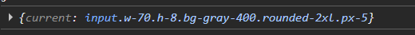

# useRef

> دسته: React Hooks & Performance

این هوک دو کاربرد اساسی دارد یکی برای دسترسی به یک المان و `property` های آن؛ دوم, ذخیره اطلاعات همانند `state` با این تفاوت که با تغییر مقدار `rerender` صورت نمیگیرد:

```jsx
const inputRef = useRef(null);
```

نحوه استفاده:

```jsx
<input

  ref={inputRef} 👈

  type="text"

  value={newNote}

  onChange={(e) => setNewNote(e.target.value)}

  className="w-70 h-8 bg-gray-400 rounded-2xl px-5"


/>


{console.log(inputRef)}
```

خروجی `log`:



نکته: `useRef` برای ذخیره‌ی مقادیری که به `UI` مربوط نیستن و نمی‌خوایم تغییرشون باعث `rerender` بشه هم استفاده میشود. مثل: شناسه‌ی تایمر (`setInterval`)، مقدار قبلی یه `state`، شمارنده‌ها، و هر مقداری که بین رندرها باید ثابت بمونه.

مثل:

```jsx

const timerId = useRef(null);

useEffect(() => {
  timerId.current = setInterval(() => { ... }, 1000);
  return () => clearInterval(timerId.current);
}, []);

```

مثال کاربرد های دیگر:

```jsx
useEffect(() => {
  phoneNumberRef.current?.focus();
}, []);
```

برای اینکه در `mount` کامپوننت `input` خاصی `focus` را بگیرد

البته روش بهتر برای این نیاز, استفاده از پراپ `autofocus` خود `input` میباشد

```jsx
<input
  autoFocus
  value={phone}
  onChange={handlePhoneChange}
  className="auth-input"
  dir="ltr"
  placeholder="09123456789"
/>
```

نکته: `autoFocus` یک `attribute HTML` هست که مرورگر فقط زمانی که عنصر به `DOM` اضافه می‌شه (`mount`) اجراش می‌کنه.
یه ترفندی هم وجود دارد اگر می‌خواهیم `React` عنصر رو کاملاً از نو بسازه (و `autoFocus` دوباره اجرا بشه)، می‌تونید از `prop key` استفاده کنیم (چون `React` با تغییر `key` کامپوننت رو `unmount` و از نو `mount` می‌کنه، پس `autoFocus` دوباره اجرا می‌شه.):

```jsx
<input key={isSentOtp ? "otp" : "phone"} autoFocus ... />
```
