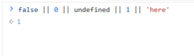

# Conditional Rendering(Logical Operator)

> دسته: React Fundamentals

چون دستورات `AND` و `OR` در `js` از `Short Circuit Evaluation` پیروی میکنند مفهومی به نام

`Conditional Rendering` به وجود می آید

```jsx
let isLogin = true;

isLogin && alert("you are login");

isLogin || alert("you are not login");
```

به گونه ای که میتوان یک شرط بدون بخش `else` نوشت

در `and` به محض اینکه به یک `false` برسد دیگر اجرا نخواهد شد بنابراین اگر `isLogin` یک مقدار `truthy` باشه، `AND` می‌ره سراغ عملوند بعدی و اون رو ارزیابی می‌کنه و `return` می‌کنه. و اگر یک مقدار `falsy` باشد به دستورات بعدی نخواهد رسید

در مورد `OR` هم ساختار مشابهه، اما برعکس `AND` عمل می‌کنه: `OR` روی اولین مقدار `truthy` متوقف می‌شه و همون رو `return` می‌کنه.

نکته: چون `alert` مقدار `undefined` رو برمیگرداند در `and` نمیتوان از دوتا `and` پشت هم استفاده کرد چون بعد از اولین `alert` مقدار `falsy value` میشود

اما در `OR` به خاطر ساختارش میتوان از چندتا `OR` برای نمایش چند `alert` استفاده کرد

```jsx
let isLogin = false;

isLogin && alert("you are login") && alert("&&");

isLogin || alert("you are not login") || alert("||");
```

نکته: به `conditional rendering` عملگر `or` میتوان fallback هم گفت

در `AND` اگر به یک مقدار `falsy` برسیم، همون مقدار `return` می‌شه و بقیه‌ی عبارت ادامه پیدا نمی‌کنه.
در `OR` اگر به یک مقدار `truthy` برسیم، همون مقدار `return` می‌شه و بقیه ادامه پیدا نمی‌کنه.



نکته: چون `0` یه `falsy` هست، `React` همون `0` رو به‌عنوان خروجی رندر می‌کنه (چون `JSX` عدد رو چاپ می‌کنه).

```jsx
{
  items.length && <List />;
} // اگه length صفر باشه، "0" روی صفحه چاپ می‌شه ❌
{
  items.length > 0 && <List />;
} // درست ✅
```
